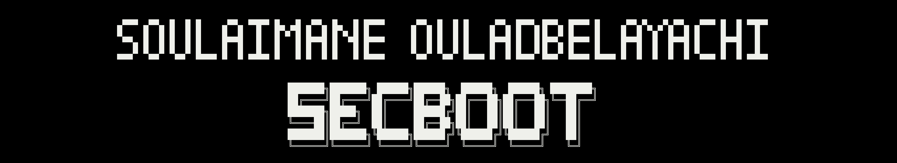
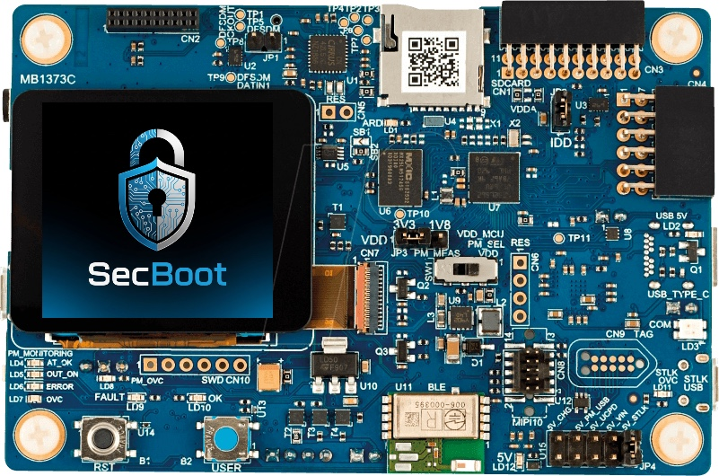
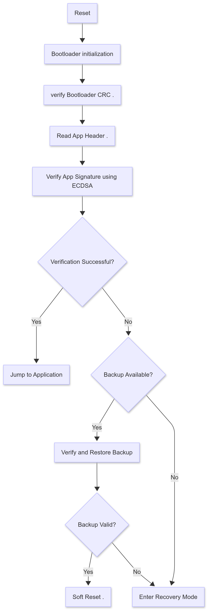
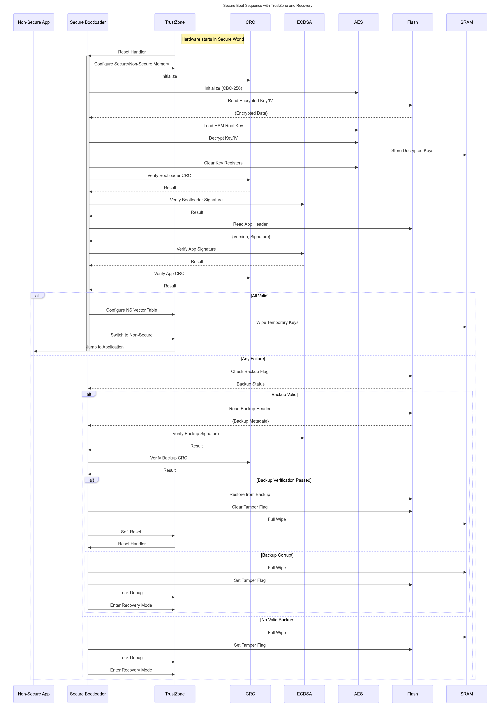

# 🔐 SecBoot – Secure Bootloader for STM32L562 📟


<p align="center">
  
</p>

<p align="center">
  
</p>


    > A lightweight, secure, and customizable bootloader for STM32L5 microcontrollers, 
    leveraging ARM TrustZone and hardware crypto to ensure device integrity and authenticity.

---

## 📚 Table of Contents

- [✨ Features](#-features)
- [🛡️ Security Architecture](#-security-architecture)
- [📁 Project Structure](#-project-structure)
- [⚙️ Requirements](#️-requirements)
- [🔐 Cryptography](#-cryptography)
- [🧪 Testing & Validation](#-testing--validation)
- [📦 Flash Layout](#-flash-layout)
- [🙋‍♂️ Acknowledgements](#-acknowledgements)

---

## ✨ Features

- ✅ Secure Boot with image authentication
- ✅ Support for **AES-128 CBC** decryption
- ✅ **SHA-256** hashing & signature validation using **ECDSA**
- ✅ TrustZone partitioning (secure/non-secure isolation)
- ✅ Secure firmware update support *(Coming Soon)*
- ✅ Hardware crypto (PKA, AES) offloading using STM32 HAL
- ✅ UART communication interface for firmware transfer *(Coming Soon)*
- ✅ Easy-to-port and modular architecture

---

## 🛡️ Security Architecture

### FlowChart

<p align="center">
  
</p>


### sequence diagram

<p align="center">
  
</p>

---

## ⚙️ Requirements

- STM32L562-DK
- VScode + Makefile + GCC toolchain
- Python 3.x (for firmware signing & bootloader building)
- Serial terminal (e.g., TeraTerm, PuTTY...)
- PyOCD

---

## 🔐 Cryptography

SecBoot leverages STM32L5's hardware cryptographic engines to ensure secure and efficient firmware verification and decryption. It follows a hybrid cryptography scheme combining symmetric encryption, hashing, and asymmetric digital signatures.

---

### 🔑 Algorithms & Roles

| Purpose             | Algorithm        | Hardware Used         | Role                          |
|---------------------|------------------|------------------------|-------------------------------|
| Encryption          | AES-128 (CBC)    | AES peripheral         | Decrypts firmware             |
| Integrity Check     | SHA-256          | HASH peripheral     | Verifies integrity            |
| Authentication      | ECDSA / RSA      | PKA peripheral         | Validates firmware signature  |
| Key Storage         | Public Key       | TrustZone               | Used for signature validation |

---


## 🧪 Testing & Validation

Rigorous testing is crucial to ensure the bootloader securely and reliably verifies and launches the firmware.

---

### 🧾 Test Objectives

| Test Case                        | Expected Result                       |
|----------------------------------|----------------------------------------|
| Valid signed & encrypted firmware | ✅ Bootloader decrypts and launches app |
| Invalid signature                 | ❌ Bootloader halts with error          |
| Corrupted encrypted payload       | ❌ Integrity check fails, app rejected  |
| Re-upload with correct firmware   | ✅ System recovers and boots normally   |
| Signature replay attack           | ❌ Detected and prevented               |

---

## 📦 Flash Layout

The STM32L562's memory is partitioned into well-defined regions to support secure boot, diagnostics, firmware update, and redundancy.

---

### 📁 Memory Map Overview

| Region              | Start Address     | Size      | Purpose                                      |
|---------------------|-------------------|-----------|----------------------------------------------|
| 🔐 Bootloader       | `0x0C000000`       | Varies    | Secure Bootloader region                     |
| 🧾 Diagnostics Log  | `0x0C00A000`       | 2 KB      | Boot status, failure codes                   |
| 🚀 Main App         | `0x08040000`       | 50 KB     | Active firmware image                        |
| 📥 Slot 1           | `0x0804D000`       | 50 KB     | First backup slot (firmware update / A/B)    |
| 📥 Slot 2           | `0x08059000`       | 50 KB     | Second backup slot (alternative image)       |
| 🆕 Update Slot      | `0x08066000`       | 50 KB     | Temporary buffer for uploaded firmware       |
| ♻️ Backup Image     | `0x08073000`       | 50 KB     | Recovery copy of known-good firmware         |

---

### 🧭 Visual Map

```text
+----------------------+ 0x0C000000
| 🔐 Bootloader        |
|          ...         |
|                      |
+----------------------+
| 🧾 Diagnostics (2KB) | 0x0C00A000
+----------------------+

+----------------------+ 0x08040000
| 🚀 Main App (50KB)   |
+----------------------+
| 📥 Slot 1 (50KB)     | 0x0804D000
+----------------------+
| 📥 Slot 2 (50KB)     | 0x08059000
+----------------------+
| 🆕 Update Slot (50KB)| 0x08066000
+----------------------+
| ♻️ Backup Image(50KB)| 0x08073000
+----------------------+
```
---

<p align="center">
  <b>© 2025 Soulaimane Oulad Belayachi</b>
</p>


